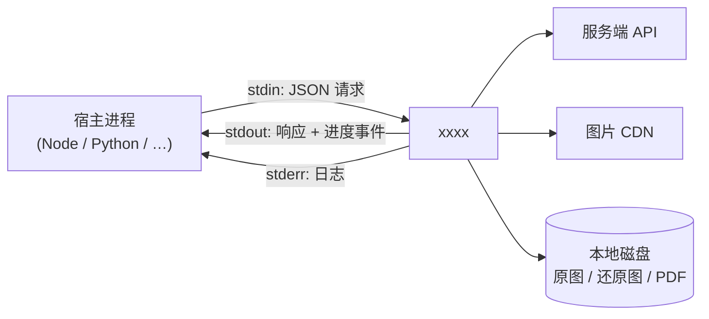

# xxxx

**漫画下载 · 切图还原 · PDF 合成工具** —— 一个说 JSON 行协议的被动进程。

[](https://github.com/all-thoughts-are-broken/xxxx/actions/workflows/ci.yml)
[](https://github.com/all-thoughts-are-broken/xxxx/releases/latest)
[](go.mod)
[](LICENSE)

**[English](README.en.md) | 简体中文**

---

## 这是什么

一个用 Go 写的命令行程序，把「从服务端拉漫画 → 还原被切乱的图片 → 合成带书签的 PDF」
这条链路的全部细节封装在一个进程里，通过 **JSON Lines** 协议对外提供能力。

它**不解析命令行参数**：启动后从 `stdin` 逐行读 JSON 请求，把响应与进度事件写到
`stdout`，日志写 `stderr`。宿主（Node / Python / Go / 任何能 `spawn` 的语言）拉起它，
就能拿到完整功能，**不需要在宿主侧再拼装任何外部工具**。



> **为什么是"被动进程"而不是库？**
> 加解密、切图还原、PDF 排版这些事一旦以库的形式链接进宿主，就会把宿主的运行时
> （Node 的版本、Python 的解释器、打包方式）绑死在上面。做成一个独立的静态二进制，
> 宿主只管收发 JSON，跨语言、跨平台、升级都简单：换个可执行文件就行。

## 特性

- **一条命令跑完全链路** —— `download_album` 内部依次做：线路探活 → 并发下载 →
  还原切图 → 合成 PDF →（可选）合并与加密，宿主只需听进度事件。
- **线路自动探活，不依赖硬编码域名** —— 官方把可用线路清单做成加密文件放在多个
  镜像上，程序会拉清单、并发测速、挑延迟最低的一条；清单拉不到时退回内置兜底列表。
- **失败不静默** —— 缺图补占位图而不是跳过（避免页码整体错位）、单章失败不影响
  其余章节、每张图的失败原因都会回报。
- **带书签的 PDF** —— 章节为一级、页面为二级书签；合并时保留嵌套结构而不是丢光。
- **断点续传** —— `skip_existing` 让重复执行跳过已完成的部分。
- **详情卡 / 评论长图渲染** —— 直接输出 PNG，含中文排版与表情图。
- **协议极简** —— 一行一个 JSON 对象，任何语言几十行就能接完；错误码机器可读。

## 安装

### 方式一：下载预编译二进制（推荐）

从 [Releases](https://github.com/all-thoughts-are-broken/xxxx/releases/latest) 下载对应
平台的压缩包，解压即用 —— **不需要 Go 环境，也不需要任何外部工具**。

| 平台 | 架构 | 产物 |
|---|---|---|
| Linux | `amd64` / `arm64` | `*.tar.gz` |
| macOS | `amd64`（Intel） / `arm64`（Apple Silicon） | `*.tar.gz` |
| Windows | `amd64` | `*.zip` |

解压后的目录结构：

```
xxxx_1.0.0_windows_amd64/
├── xxxx.exe               可执行文件
├── config.example.json    配置示范，需要时复制成 config.json 再改
├── fonts/                 渲染用中文字体（见 fonts/README.md）
│   ├── NotoSansSC-Regular.ttf
│   ├── Noto-Sans-SC-Bold-2.ttf
│   ├── LICENSE-OFL.txt
│   └── README.md
├── README.md
├── README.en.md
└── LICENSE
```

每个产物都附有 SHA-256 校验和，汇总在 Release 页面附带的 `checksums.txt` 里。校验方式：

```bash
sha256sum -c checksums.txt            # Linux / macOS
certutil -hashfile xxxx.exe SHA256    # Windows
```

### 方式二：从源码构建

需要 **Go 1.27 或更高版本**。本项目的依赖全是纯 Go（无 cgo），因此可以随意交叉编译。

```bash
git clone https://github.com/all-thoughts-are-broken/xxxx.git
cd xxxx

# Linux / macOS
go build -trimpath -ldflags "-s -w" -o bin/xxxx ./cmd

# Windows
go build -trimpath -ldflags "-s -w" -o bin/xxxx.exe ./cmd
```

启动（不需要任何参数）：

```bash
./bin/xxxx
```

进程启动后会立刻往 `stdout` 发一帧 `ready` 事件，表示可以开始下命令了：

```json
{"event":"ready","data":{"base_url":"","cdn_host":"","pid":12345,"version":"1.0"}}
```

第一行是准备就绪的信号。**在收到 `ready` 之前不要发请求**（协议层虽然能缓冲，
但宿主等待就绪事件可以顺便拿到探活结果）。

## 快速开始

不用写任何代码，用管道喂 JSON 就能试。

**查一本作品的详情：**

```bash
echo '{"cmd":"get_album_detail","task_id":1,"params":{"id":1472136}}' | ./bin/xxxx
```

`stdout`（为了可读性折了行，实际每种帧各占一行）：

```json
{"event":"ready","data":{"base_url":"","cdn_host":"","pid":12345,"version":"1.0"}}
{"task_id":1,"result":{"id":1472136,"name":"……","chapters":[{"id":1472136,"name":"第1章","sort":1}]}}
```

**下载整本并合成 PDF**（长任务，期间会持续输出 `progress` 事件）：

```bash
echo '{"cmd":"download_album","task_id":2,"params":{"id":1472136,"all_chapters":true,"merge_chapters":true}}' | ./bin/xxxx
```

**优雅退出：**

```bash
echo '{"cmd":"shutdown"}' | ./bin/xxxx    # 先回 {"task_id":…,"result":"bye"}，再退出
```

`stdin` 被关闭（EOF）时进程同样会退出 —— 它会先等在途任务把结果帧写完，再结束。

**看看这个版本支持哪些命令：**

```bash
echo '{"cmd":"commands"}' | ./bin/xxxx
```

---

## 目录

1. [通信协议](#1-通信协议)
2. [从 Node.js 调用](#2-从-nodejs-调用)
3. [命令参考](#3-命令参考)
4. [配置](#4-配置)
5. [产物目录结构](#5-产物目录结构)
6. [实现说明](#6-实现说明)
7. [常见问题](#7-常见问题)
8. [开发与贡献](#8-开发与贡献)
9. [分层](#9-分层)
10. [第三方组件与许可](#10-第三方组件与许可)
11. [免责声明](#11-免责声明)
12. [许可证](#12-许可证)

---

## 1. 通信协议

### 1.1 传输格式

JSON Lines：一行一帧，`\n` 分隔，**不允许跨行**。单行上限 32 MiB。
请求与响应不保证一一对应顺序。

### 1.2 请求

```json
{"cmd":"get_album_detail","task_id":1,"params":{"id":1472136}}
```

| 字段 | 类型 | 说明 |
|---|---|---|
| `cmd` | string | 命令名，必填 |
| `task_id` | number \| string | 由宿主分配，**原样回显**（数字回数字，字符串回字符串） |
| `params` | object | 命令参数；省略等价于 `{}` |

`task_id` 只用于宿主把响应配回请求。省略 `task_id` 时服务端仍然会执行，
只是响应里也不带 `task_id`。

### 1.3 响应

成功：

```json
{"task_id":1,"result":{"id":1472136,"name":"……","chapters":[...]}}
```

失败：

```json
{"task_id":1,"error":"not_found: 作品 999 不存在","error_code":"not_found"}
```

| 字段 | 类型 | 说明 |
|---|---|---|
| `task_id` | number \| string | 原样回显请求里的值；请求没带则本字段不出现 |
| `result` | any | 成功时的结果，形状由命令决定 |
| `error` | **string** | 失败原因，**人类可读的一句话**（含 `code: ` 前缀） |
| `error_code` | string | 机器可读的错误码，见下表 |

错误码：`bad_request`、`unknown_command`、`invalid_params`、`not_found`、
`network`、`api`、`decrypt`、`io`、`canceled`、`timeout`、`panic`、`internal`。

> `error` 是字符串而不是对象，是为了让宿主可以直接 `new Error(msg.error)`。
> 需要按码分支处理时读 `error_code`，不要去解析 `error` 的文本。

### 1.4 事件（进度）

```json
{"event":"progress","data":{"task_id":1,"stage":"download","done":12,"total":68,"message":"正在下载"}}
```

| 字段 | 说明 |
|---|---|
| `event` | 事件名：`ready` / `progress` / `protocol-error` |
| `data` | 事件载荷；进度事件里含 `task_id` |

### 1.5 ⚠️ 四条必须遵守的约定

这四条是宿主通信桥已经写死的假设，服务端与宿主都必须遵守，
否则会出现"promise 提前 resolve"、"错误变成 `[object Object]`"这类难查的问题：

1. **事件帧不能有顶层 `task_id`。**
   桥用 `'task_id' in msg` 区分「响应」与「事件」。进度事件如果带上顶层
   `task_id`，就会被误判成响应，把还没做完的 promise 提前 resolve 掉。
   所以 `task_id` 只能放在 `data` 里面。

2. **`error` 是字符串。** 见上。

3. **`shutdown` 命令必须先回 `"bye"` 再退出。**
   宿主靠这一帧确认进程已经优雅退出；直接 `os.Exit` 会让宿主的等待永久挂起。

4. **响应顺序不保证。** 命令是并发执行的（默认最多 8 个同时跑），
   谁先完成谁先出帧。宿主必须用 `task_id` 匹配，不能假设先进先出。

### 1.6 stdout 保护

第三方库（`pdfcpu`、`gofpdf`、标准库的 `fmt.Println`）随时可能往 `os.Stdout`
直接打印。一旦发生，宿主就会在协议流里读到垃圾行，整个 promise 链错乱。

因此在 `main` 里做了这件事：

```go
realStdout := os.Stdout
os.Stdout = os.Stderr   // 此后任何"往 stdout 打印"的代码都只会写进日志通道
```

真正的 stdout 交给协议层独占。**新增代码请一律用 `log` 或写 `stderr`**，
不要用 `fmt.Println` 打日志——它现在不会污染协议，但会消失得莫名其妙。

---

## 2. 从 Node.js 调用

如果没有现成的通信桥，按下面这套裸 `spawn` 骨架接即可：

```js
const { spawn } = require('node:child_process');
const readline = require('node:readline');

const proc = spawn('./bin/xxxx.exe', [], { stdio: ['pipe', 'pipe', 'pipe'] });

// stderr 是日志通道，直接转发出去即可，不要尝试解析
proc.stderr.on('data', (b) => process.stderr.write(b));

const pending = new Map();   // task_id -> {resolve, reject}
let nextId = 1;

const rl = readline.createInterface({ input: proc.stdout });
rl.on('line', (line) => {
  if (!line.trim()) return;
  let msg;
  try { msg = JSON.parse(line); } catch { return; }

  // 判据必须与协议层一致：有顶层 task_id 才是响应
  if ('task_id' in msg) {
    const p = pending.get(msg.task_id);
    if (!p) return;
    pending.delete(msg.task_id);
    // error 是字符串，可直接喂给 Error
    msg.error ? p.reject(new Error(msg.error)) : p.resolve(msg.result);
    return;
  }
  if (msg.event === 'progress') onProgress(msg.data);
  if (msg.event === 'ready')     onReady(msg.data);
});

function call(cmd, params = {}, timeout = 300_000) {
  const task_id = nextId++;
  return new Promise((resolve, reject) => {
    const timer = setTimeout(
      () => { pending.delete(task_id); reject(new Error(`timeout: ${cmd}`)); },
      timeout,
    );
    pending.set(task_id, {
      resolve: (v) => { clearTimeout(timer); resolve(v); },
      reject:  (e) => { clearTimeout(timer); reject(e); },
    });
    proc.stdin.write(JSON.stringify({ cmd, task_id, params }) + '\n');
  });
}

// 退出：发 shutdown，等 "bye"，再等进程真正结束
async function shutdown() {
  await new Promise((resolve) => {
    rl.on('line', (line) => {
      if (line.includes('"bye"')) resolve();
    });
    proc.stdin.write(JSON.stringify({ cmd: 'shutdown' }) + '\n');
  });
  await new Promise((r) => proc.on('exit', r));
}

// 用法
const info = await call('get_album_detail', { id: 1472136 });
console.log(info.name, info.chapters.length);

const pdf = await call('download_album', {
  id: 1472136, all_chapters: true, merge_chapters: true,
}, 3600_000);
console.log('PDF:', pdf.pdf_path, `${pdf.total_pages} 页`);
```

> 注意 `shutdown()` 之后 `proc` 就不该再用了；想继续用请重新 `spawn`。

---

## 3. 命令参考

### 3.1 协议内建命令

这三个命令由协议层直接处理，不经过业务层：

| 命令 | params | 说明 |
|---|---|---|
| `commands` | — | 列出当前版本支持的全部命令，result 形如 `{version, commands:[...]}` |
| `cancel` | — | 按 `task_id` 取消在途任务，result 为 `{canceled: <取消数>}` |
| `shutdown` | — | 回 `"bye"` 后优雅退出（见 1.5） |

`cancel` 匹配的是请求里的 `task_id`。任务收到取消后，其接口调用会尽快返回
`canceled` 错误；已经在写盘的那一张图会先写完，不会留下半个文件（落盘是原子的，
见第 5 节）。

### 3.2 配置

| 命令 | params | result |
|---|---|---|
| `config_get` | — | 当前配置全量 |
| `config_set` | 任意配置子集（增量覆盖） | 覆盖后的配置全量 |
| `probe` | — | `{base_url, cdn_host}` |

`probe` 会真发一次阅读页请求，一次性验证：线路可达、**响应能解密**（密钥与签名都对）、
API 版本匹配，并顺手学到图片 CDN 域名。不传 `base_url` 时，下面所有联网命令都会自动先探活一次。

探到之后线路只在内存里，不会写回配置文件；想让宿主在**每次启动时跳过探活**，
就先用 `probe` 拿一次结果、之后随配置把 `base_url`/`cdn_host` 一起传进来
（取舍的详细理由见第 4 节末尾）。

**线路不是硬编码的。** 官方把可用线路清单做成一个加密文件放在几个对象存储镜像上
（按地域分了几个镜像），于是线路轮换不需要发新版本；我们如果只硬编码一份，
线路一换就整体失效。探活的实际顺序是：

1. 拉线路清单（多个镜像依次试，任一成功即用），解出当前全部候选线路
2. 对候选**并发**发一次真实阅读页请求，取延迟最低的那条
3. 清单拉不到就退回内置兜底列表，顺序试、命中即停

进度事件的 `extra` 里带 `nodes`（清单给出的候选）、`lines`（每条线路的耗时与成败）、
`from_nodes`（是否用上了动态清单），宿主可以直接展示"当前用哪条、各条多快"。

**为什么探活必须真的解密一次，而不是看状态码**：作废的线路照样可能返回 HTTP 200
和一个结构完全合法的信封，只是响应解不开 —— 看起来"通了"，实际一条图都下不到。

### 3.3 查询

| 命令 | params | result |
|---|---|---|
| `get_album_detail` | `{id}` | `{id, name, description, author, tags, likes, views, comments, add_time, chapters:[{id,name,sort}], cover_url, redirected_from?, is_favorite}` |
| `get_album_comment` | `{aid, all_pages?, max_pages?}` | `{aid, total, pages, comments:[...], failed_pages?}` |
| `get_comic_read` | `{id}` | `{id, name, images:[{page, image}], scramble_id}` |

`get_album_detail` 与 `get_comic_read` 的 `id` 既可以是作品号也可以是章节号 ——
服务端会识别重定向，结果里用 `redirected_from` 告诉你原始请求的是哪个。

`get_comic_read` 响应里含 `scramble_id`（该作品该时期的切图阈值）与每页图片地址，
是 `restore_images` / `download_album` 的输入来源。

### 3.4 下载

`download_album` — 完整的「下载 → 还原 → 合成 PDF」流水线。

| 参数 | 类型 | 默认 | 说明 |
|---|---|---|---|
| `id` | int | 必填 | 作品号或章节号 |
| `all_chapters` | bool | 有 `chapter_ids` 时为 false，否则 true | 全部章节 |
| `chapter_ids` | []int | — | 指定章节（与 `all_chapters` 同时给出时以此为准） |
| `max_chapters` | int | 0 | 最多处理几章（0=不限） |
| `merge_chapters` | bool | false | 多章是否合并成一个 PDF；只有一章时不需要它，`pdf_path` 直接取那一章的 PDF |
| `raw_dir` | string | 配置 `download_dir` | 原始（混淆）图片落盘目录 |
| `output_dir` | string | 配置 `output_dir` | 还原图 / PDF 输出目录 |
| `output_pdf` | string | 自动 | 合并后的 PDF 路径 |
| `restore_format` | string | `jpg` | 还原输出格式：`jpg`/`jpeg`/`png`；传其它值（含 `webp`）会**静默退回 `jpg`**（见 6.3） |
| `skip_pdf` | bool | false | 只下载还原，不合成 PDF |
| `keep_raw` | bool | false | 保留原始混淆图片 |
| `skip_images` | bool | false | 只出 PDF，还原图不留 |

结果：

```json
{
  "aid": 1472136, "name": "……",
  "chapters": [{
    "id": 1472136, "name": "第1章",
    "images": 68, "failed": 0,
    "raw_dir": "...", "image_dir": "...",
    "pdf_path": "...", "pdf_bytes": 24280806
  }],
  "pdf_path": "...", "pdf_paths": ["..."],
  "encrypted": false,
  "total_pages": 68, "failed_total": 0, "elapsed_ms": 41230
}
```

单章失败不会中断整次任务：该章的 `error` 有值、其余章节照常产出。
单张图失败的明细在 `chapters[].failures`（**最多 20 条**，超出部分只计数、
记在 `dropped_failures`，避免结果帧被上千条错误撑爆）。

`merge_chapters` 与 `skip_pdf` 不能同时为 true（会报 `invalid_params`）。

进度事件的 `stage` 依次为：`probe` → `download` → `restore` → `pdf` → `merge` → `encrypt`。

### 3.5 本地处理

| 命令 | params | 说明 |
|---|---|---|
| `restore_images` | `{aid, scramble_id, input_dir?, images?, output_dir, format?, workers?, skip_existing?}` | 还原切图 |
| `convert_images_to_PDF` | `{images?, input_dir?, output_path, chapter?, layout?, per_image_bookmark?, max_page_height?, password?, owner_password?}` | 目录或列表合成 PDF |
| `merge_pdf` | `{inputs:[...], output_path, password?, owner_password?}` | 按入参顺序合并 |
| `encrypt_pdf` | `{input_path, output_path, password, owner_password?}` | 加密（仅保留打印权限） |

`restore_images` 的 `images` 与 `input_dir` 二选一；给了 `images` 就按列表走。
**`aid` 必须是阅读页自身的 id（章节号），不是作品号**——见 6.1。

`convert_images_to_PDF` 的 `per_image_bookmark` 是**可省略**的：不传时跟随配置
`pdf_per_image_bookmark`（默认 `true`），传 `true`/`false` 则以传的为准。
这样「下载出来的 PDF」和「手动转出来的 PDF」不会出现一个有页码书签、一个没有。

### 3.6 渲染

| 命令 | params | 说明 |
|---|---|---|
| `render_album_detail_image` | `{aid, output_path?, scale?}` | 作品详情卡片 PNG（2160×1280） |
| `render_album_comment_image` | `{aid, output_path?, scale?}` | 评论区长图 PNG（1920×N） |

这两个命令会自己拉作品详情 / 评论，并按需下载封面、头像、勋章素材，
以及评论正文里的表情图（贴纸 + Twemoji，见 6.13）。
渲染需要中文字体（见第 4 节）。字体缺失时报 `internal`，错误信息里会写明期望的路径。

`scale` 是超采样倍率（`<=0` 用默认值）：想要更清晰的图就传 `2`，代价是耗时与体积
按平方增长。

---

## 4. 配置

查找顺序（先命中者生效）：

1. 环境变量 `JM_CONFIG` 指定的文件
2. 可执行文件同级的 `config.json`
3. 当前工作目录的 `config.json`

**文件不存在不是错误**，用内置默认值。仓库里的 `config.example.json` 就是一份
可用的起点，需要时复制成 `config.json` 再改。可以用 `config_set` 增量写回。

```jsonc
{
  // ---- 网络 ----
  "proxy": "",                  // http/https/socks5，空=直连
  "base_url": "",               // 空则启动时自动探活
  "cdn_host": "",               // 空则从阅读页响应里提取
  "app_version": "1.8.0",       // APP 版本号，参与 token 签名
  "secret": "……",               // 响应解密盐（默认值与内置 APP 对齐）
  "user_agent": "Mozilla/5.0 …",// 默认与 APP 请求头一致，避免被风控拦
  "timeout_sec": 30,            // 单次接口请求超时（秒）
  "probe_aid": 10086,           // 探活用作品号（需确保该作品存在）

  // ---- 下载 ----
  "download_dir": "download",   // 原始（混淆）图片
  "output_dir": "output",       // 还原图 / PDF
  "workers": 4,                 // 并发数；<=0 会被归一化为 4
  "max_retries": 3,             // 单文件下载重试次数
  "skip_existing": true,        // 断点续传
  "scramble_id": 220980,        // 默认切图阈值，被阅读页响应覆盖

  // ---- PDF ----
  "pdf_password": "",           // 空 = 不加密
  "pdf_owner_password": "",     // 空 = 同用户密码
  "pdf_max_page_height": 0,     // 0 = 不限高（一章一条长页）
  "pdf_layout": "single",       // single | paged
  "pdf_per_image_bookmark": true, // 是否给每页建二级书签（见 6.7）

  // ---- 渲染 ----
  "font_regular": "fonts/NotoSansSC-Regular.ttf",
  "font_bold": "fonts/Noto-Sans-SC-Bold-2.ttf"
}
```

> 上面是带注释的**说明版**；真实的 `config.json` 走严格的 JSON 解析，**不能带注释**，
> 也没有"多一个字段无所谓"这种宽容 —— 未知字段会被拒绝，免得拼错了却静默生效。

字体路径会按「配置里写的 → 可执行文件同级 → 工作目录」依次解析，
所以从 `bin/` 里启动、而配置里写的是相对仓库根的路径也能找到。
找不到字体时渲染命令会报错，其余命令不受影响（详见 `fonts/README.md`）。

**线路不会自动写回配置文件。** `base_url` 为空时每个进程都会自己探一次活
（拉官方清单 + 并发测速，秒级），结果只留在内存。这是刻意的取舍——
线路几个月就会整体失效，一旦落盘，下次启动就会走 `base_url != ""` 的短路，
拿着一条死线路再也不探活。想省掉探活的宿主可以：调一次 `probe` 命令，
把响应里的 `base_url`/`cdn_host` 记下来，下次启动时随配置传进来；传了就不探。

（`ready` 事件里的 `base_url`/`cdn_host` 是**启动时的配置值**，默认是空的，
不能当作探活结果用——探活发生在随后第一次需要网络的命令里。）

---

## 5. 产物目录结构

```
<raw_dir>/<aid>/<章节号>/00001.webp          原始混淆图（keep_raw 时才留）
<output_dir>/<aid>/<章节号>/00001.jpg        还原后的图
<output_dir>/<aid>/<章节名>.pdf              单章 PDF（章节名不可用时退回章节号）
<output_dir>/<aid>/<aid>.pdf                 合并后的整本 PDF（merge_chapters 时）
<output_dir>/.cache/cover_<aid>.jpg          渲染素材缓存：封面 / 头像 / 勋章
<output_dir>/.cache/avatar_<cid>.jpg
<output_dir>/.cache/emoji_<md5(直链)>.png    评论正文里的表情（贴纸与 Twemoji）
```

内部（未还原）目录保持服务端的零填充命名 `00001`，这样即使是用别的工具下的原始图，
也能直接喂给 `restore_images` 还原。

落盘一律「先写临时文件、成功后再改名」：下载的原始图是 `00001.webp.part`，
还原结果是 `00001.jpg.part`，合并 PDF 是 `.xxx.pdf.tmp-*`。四处都守这条纪律
（`downloader.go`、`image_processor.go`、`download_chapter.go:copyFile`、
`render.go:WritePlaceholder`）。

**临时名必须用 `.part` 后缀，不要写成保留原扩展名的形式**（如
`.part-00001.jpg`）：下游是按扩展名白名单扫目录取图的，那种名字会被当成正常
图片收走。代价是 `imaging.Save` 推断不出格式，得显式
`FormatFromFilename` + `Encode`（与 `Save` 内部做的事完全一样，字节不变）。

**如果改名这一步失败，产物看起来"页数齐全"，但内容可能全被
占位图顶替**（见 6.6）。核验产物时别只数文件个数，要看单页体积 ——
占位图是纯白底加一行小字，只有几十 KB。

---

## 6. 实现说明

这一节记录几个"看起来可以简化、但改了会坏"的点。**这些不是随口写的注意事项，
而是踩过坑之后固化成测试的约定**，改动前请先看对应的测试。

### 6.1 切图还原：`aid` 必须是阅读页 id

服务端把每页图片切成 `N` 段后打乱顺序，`N` 由 `get_num(aid, page)` 决定。
这里的 `aid` 是**阅读页自身的 id（即章节号）**，不是作品号。传错不会报错，
只会安静地还原出一片花屏——因为段数算错时切分点就全错了。

对齐原实现：`scramble_image(img, readList.id, readList.scramble_id, img.alt)`，
其中 `readList.id` 就是章节号。

### 6.2 `get_num` 的中间区间是**常数 10**

```
aid < scramble_id          → 0（不切图）
scramble_id <= aid < 268850 → 10   ← 常量，不要"补"成 %10*2+2
268850 <= aid <= 421925     → (md5(aid+name) 末位 ASCII) % 10 * 2 + 2
aid >= 421926               → (md5(aid+name) 末位 ASCII) % 8 * 2 + 2
```

中间那段是常量 10，原因在原实现里：它用 `name.charCodeAt(...)` 取值后
去 `switch` 匹配 `0..9`，而 `charCodeAt` 返回的是 `48..102`，永远匹配不到，
于是落到 `default: 10`。

**这是服务端的历史行为，不是我们的 bug。** 把它"修正"成 `%10*2+2` 会让
`scramble_id <= aid < 268850` 这个区间的作品全部还原成花屏。
`crypto_test.go` 里有一份逐行翻译的 JS 版本做穷举对拍，改动前请先跑它。

### 6.3 还原必须输出 JPEG

PDF 库（gofpdf）只认 `jpg`/`png`/`gif`，**不支持 webp**。而服务端原始图是 webp，
所以还原阶段就要输出 JPEG，不能把 webp 直接递到 PDF 层。

`restore_format` 接受 `jpg`/`jpeg`/`png`（`png` 也在 gofpdf 支持范围内），
**传其它值会静默退回 `jpg`**——包括显式传 `webp`。这是有意为之：
webp 无论如何都产不出来（原始图解码后只能重编码成 jpg/png），
与其报错不如给出一个确定可用的结果。代价是拼错的格式名不会报错，
只会发现"格式没生效"。

（PDF 层留了一条兜底：遇到 webp/bmp/tiff/avif 会先解码再重编码。
这条路径只服务于"拿未还原的原始图直接合成 PDF"，正常流程用不到。）

### 6.4 GIF 不做还原

原实现里 `scramble_image` 遇到 `.gif` 会提前返回。GIF 保持 `.gif` 原样拷贝，
gofpdf 原生支持 gif，所以不影响 PDF 合成。

### 6.5 一章 = 一个只有一页的长 PDF

产品形态如此：整章所有内容拼成**一条长页**，读者上下滚动。
有些漫画（比如韩漫）上下画面是连续的，这样读更顺。

因此 `pdf_max_page_height` 默认 `0`（不限高），也不做任何缩放。
需要更强阅读器兼容性时可设上限：PDF 规范本身不限页高，但部分阅读器
超过 200 英寸（14400pt）会拒绝打开。设了上限后整页等比缩放——只作用于
页面的 CTM，图片仍以原始分辨率嵌入，**不损失画质**。

`pdf_layout: paged` 是另一条路：按上限分页，但不切开任何一张图。

### 6.6 缺图必须补占位图，不能跳过

任何一页缺文件都要在该位置写一张占位图。跳过一张会让后面**所有页码前移**，
读者看到的页码与真实章节整体错位——这比一张写着「第 5 页不可用」的占位图
糟糕得多。

这条约定在两层都实现了：

- 下载链路（`service`）：图片下载/还原失败时立刻写占位图，保证 `image_dir`
  里的文件数与真实页数一致。
- PDF 层（`utils.loadPageImages` / `loadFittedPageImagesFromDir`）：解码失败的
  图替换成占位图，而不是让整次合成失败。

容错边界是分两档的：**扩展名就不是图片** → 硬报错（调用方传错参数，
静默吞掉会让人以为整章都合进去了）；**扩展名是图片但解码失败** → 换占位图。

### 6.7 页面书签：默认建二级书签，标题去掉前导 0

每张图的二级书签取文件名主干并去掉前导 0（`00012.jpg` → `12`）。
书签是给人导航用的，去零更好读。

二级书签**默认开启**（`pdf_per_image_bookmark: true`）。一章虽然只占 PDF 的一页，
但"这章有多少页、当前是第几页"本身就是导航信息，而且这是长期使用下来的既定结构。
长章节会有几百个大纲节点，个别阅读器会卡，宿主可以关掉——关掉只是不写页码书签，
章节书签仍然保留。

书签标题的编码见 6.12。

各页统一宽度时取的是**出现次数最多的宽度**（众数）而不是第一张的宽度：
作品里偶尔会混进一张尺寸不同的图（跨页、广告页），取第一张会被那一张带偏。

### 6.8 PDF 合并必须用 `MergeBookmarkModePreserve`

合并走 `pdfcpu`，且必须显式设置 `MergeBookmarkModePreserve`。默认模式会在
每个文件外面套一层"文件名"书签，把章节书签压深一级。对照产出可以很明显地看出：

| 合并方式 | 结果 |
|---|---|
| `gofpdi` | **书签全丢**（已确认，不要用） |
| `pdfcpu` 默认模式 | 每个文件外多套一层"文件名"书签 |
| `pdfcpu` + `MergeBookmarkModePreserve` | 正确：章节在根、页码挂在章节下 |

### 6.9 加密：所有者密码不能硬编码

`encrypt_pdf` 用 AES-256，只保留打印权限。所有者密码默认取用户密码；
原型里曾硬编码成一个固定值——所有者密码是用于解除权限限制的，
写死一个公开值等于没有权限保护。

### 6.10 图片 CDN 域名会轮换，失败要**换域名**而不是重试

接口下发的图片直链域名是**在一批镜像里轮换**的，其中有的已经下线 —— 实测有的
连 TLS 都握不上手（connection reset），而**同一路径**换个镜像域名就是好的，
返回字节数完全一致；`?t=` 参数也不是必须的，裸路径同样能下到。

所以下载失败时的正确动作是**换域名重试**，而不是死盯同一个 URL 重试 N 次。
`download_album` 会给每页带一组备用直链：路径与 query 不变、只换域名；候选全部
来自服务端自己给的信息（探活学到的 CDN 域名 + 本章直链里出现过的域名），
不硬编码任何域名。实现见 `utils.BatchWithAlternates` 与 `service.alternateURLs`。

顺带一个易踩的点：下载器默认**会校验「下到的内容是不是图片」**（用来拦
"线路返回错误页 HTML 但状态码是 200" 这种坑）。所以它失败时的报错未必是连接问题 ——
别只看最后一条错误就下结论，每条候选的失败原因可能不同。

### 6.11 `token` 与 `tokenparam` 千万别接反

签名计算的返回顺序历史上是 `(tokenparam, token)`，很容易写反。写反**不会报错**，
只会在解密时炸出「去除填充失败: 非法的填充长度 N」—— 看着像加解密算法坏了，
实际是鉴权头错位：服务端在 `tokenparam` 里读不到时间戳，就改用自己时钟推导响应密钥。
`internal/client/transport_test.go` 里有带真实抓包值的回归测试锁住它。

排查手法：在 transport 链的**最底层**套一层日志 RoundTripper 打真实请求头。
套在签名层外面是看不到的 —— 那一层拿到的是签名前的请求。

### 6.12 书签标题必须自己编码成 UTF-16BE，否则中文乱码

写书签前，标题要先过 `outlineText()` 转成 UTF-16BE + BOM。

原因：`gofpdf` 只在**当前字体是 UTF-8 字体**时才替我们做这个转换
（`Bookmark` 内部判 `isCurrentUTF8`）。本项目的 PDF 页面上是纯图片、
不加载任何字体，所以它把 Go 字符串**按原始字节**写进 `/Title`。
PDF 规范规定：不带 BOM 的字符串按 PDFDocEncoding 解释，"第" 的 UTF-8 字节
`E7 AC AC` 于是被读成 `第` —— 整棵大纲树在真实阅读器里都是乱码。

**这条特别容易"假绿"**：`pdfcpu` 解码 PDF 字符串时有一段宽容回退
（`StringLiteralToString`：`accept real-world UTF8 before falling back to
PDFDocEncoding`），会把无 BOM 的裸 UTF-8 也当 UTF-8 解出来。所以
「用 pdfcpu 读回来等于 `第1章`」**不能**证明编码是对的 —— 旧的断言就是这么
通过的。`internal/utils/pdf_outline_test.go` 因此直接查 `/Title` 的原始字节，
要求每个都以 `FE FF` 开头。

顺带一提，这层编码对纯数字页码也无害（每字符多占一字节），统一走一条路
比"中文才编码"更不容易漏。

### 6.13 评论正文里的表情是**图片**，不是字体问题

评论里的「表情」是两类图片，都必须重新抓下来才能画：

1. **服务端贴纸**：正文里直接就是
   `/media/emoji/<sha1>.png" alt="惊喜">`；
2. **手打的 Unicode 码位**（`😋` `❤️` `👍🏽`）：映射到 Twemoji 的 72x72 PNG
   （`https://cdnjs.cloudflare.com/ajax/libs/twemoji/14.0.2/72x72/<key>.png`）。

**别指望字体**：`Noto Sans SC` 对整片 emoji 区都没有字形（实测 `glyphIndex=0`，
画出来是个 □），而装 emoji 字体也解决不了第 1 类 —— 那些贴纸压根不是码位。
老实现把正文里的标签一律 `stripHTML` 掉，于是**只发表情的评论被洗成空串**，
落进「这条评论没有内容」兜底分支；夹在文字里的表情也整段消失。

现在排版走行内混排（`internal/utils/inline_text.go`）：文字逐字换行、图片当成
不可拆的原子，两者共用一个行盒；`[alt]` / 原始码位只是**图抓不到时**的兜底，
绝不能把这段内容丢掉（丢掉又会让纯表情评论变回"没有内容"）。

抓图在 service 层做（`internal/service/inline_images.go` 的 `fetchInlineImages`）：
渲染层不做网络请求，整棵评论树里的表情按地址去重后一次性批量下载，再以
「直链 → 本地文件」的形式注入渲染入参。贴纸可以换镜像域名重试（见 6.10），
Twemoji 不行（它在第三方 CDN 上，套同一批镜像域名只会白等一轮）。

**Twemoji 的文件名有两条坑**（对着 cdnjs 上的 `14.0.2` 目录实测）：

- **变体选择符 FE0E/FE0F 要去掉**：目录里只有 `2764.png`，**没有**
  `2764-fe0f.png`；
- **码位不加前导零**：`1f44d-1f3fb.png` 存在，`0031-20e3.png` 是 404。

ZWJ 序列（`1f468-200d-1f469-200d-1f467`）与肤色修饰符（`1f44d-1f3fb`）原样保留，
国旗是两个区域指示符连写（`1f1e8-1f1f3`）。规则锁在
`inline_text_test.go:TestEmojiKeyMatchesTwemojiFileNames`，期望值全部对着线上
目录核过。

### 6.14 渲染是**串行**的，别把 `renderMu` 去掉

详情卡与评论图的底层是一堆**无锁包级状态**：`faceCache` / `ascentCache` /
`faceCacheDcs` / `fontFaces` 四张 map，加上 `opentype.Face` 自带的可变字段
（`sfnt.Buffer` / `vector.Rasterizer` / `image.Alpha`，以及惰性填充的 metrics），
还有被复用的 `measureCtx`。

协议层默认允许 8 个请求同时在跑，宿主完全可以同时下发详情卡与评论图。
两个 goroutine 一起进 `face()` 的结果是：

```
fatal error: concurrent map writes
```

**这是运行时的 fatal，不是 panic** —— `invoke` 里的 `recover` 接不住，整个进程
直接消失，宿主侧表现为所有在途 promise 永不 resolve。所以 `renderAlbumCard` 与
`renderCommentPage` 各拿一把 `renderMu` 串行化。

不要改成"给每张 map 单独加锁"：`font.Face` 本身就不是并发安全的，只锁 map 会把
竞态从"崩溃"降级成"随机画错字"，更难查。字体路径另用 `fontPathMu`，好让
`config_set` 不必等一次渲染跑完。锁在
`render_concurrency_test.go:TestConcurrentRenderIsSafe` —— 这条测试**不需要
`-race` 也能抓越界**，去掉 `renderMu` 后测试进程会直接消失。

### 6.15 重试判定看错误**类型**，不看错误文案

`isDeterministicFailure` 决定一个失败值不值得退避重试，它必须靠类型判断
（`*statusError` 的 `StatusCode`、哨兵错误 `errNotAnImage`），不能去 grep 错误
信息里的 "状态码 404" —— 文案改一次，404 就会退化成"被当临时故障反复重试"，
而这种退化**测试不会红**，只是每次失败都白等 1s / 2s / 4s。

判据是：4xx 一律确定性失败，只有 408（请求超时）与 429（限流）值得重试；
5xx 与网络错误值得重试。`downloader_test.go` 里有一条专门验证 `%w` 包装后
`errors.As` 仍能穿透 —— 因为 `DownloadWithRetry` 会把最后一次错误再包一层。

### 6.16 首次探活只发生一次

`base_url` 为空时，每个并发请求都会走到探活分支。探活要拉三个镜像的清单
再并发测速多条线路，不串行化就是每个请求各探一次 —— 实测同时下发详情卡与评论图
时，两个请求探到了**两条不同**的线路，最终用哪条取决于谁最后写。

所以 `ensureClient` 的慢路径走 `probeMu` + double-check：只有第一个请求真探，
其余在锁上等一小会儿直接复用在途结果，并且等锁后会再查一次配置。

`base_url` 一旦有值就走快路径，完全不碰这把锁。

### 6.17 `[]` 表示**对象不存在**，要映射成 `not_found` 而不是 `internal`

服务端对「id 不存在」不用 404，而是回一个**空 JSON 数组**：

```
GET /album?id=500000        → []
GET /comic_read?id=500000   → []
```

直接 `json.Unmarshal` 进结构体会炸出
`json: cannot unmarshal array into Go value of type client.AlbumDetailResult`，
再往上被兜成 `internal` —— 宿主看到的是"工具内部错误"，而不是"这本不存在"。
实测抽 20 个作品号，7 个不存在的全落进这个坑。

统一在 `client.decodeObject` 里拦：先看响应体 trim 后是不是字面量 `[]`，是就
`protocol.Wrap(protocol.CodeNotFound, errEmptyArray, ...)`，各接口再用
`errors.Is(err, errEmptyArray)` 换成带 id 的人话文案（「作品 %d 不存在」）。

**别把这条规则推广到"评论为空"** —— 先实测确认过语义：
`GET /forum?aid=<不存在>` 回的是正常对象（`total=0`），不是 `[]`。所以
`get_album_comment` 永远不会命中这个分支，不会把"没评论"误判成"作品不存在"。
判空数组用的是**响应体字面量**，不是"解出来是空 slice"，否则正常返回
`comments: []` 的响应也会被误伤。

锁在 `client_test.go:TestDecodeObjectMapsEmptyArrayToNotFound` 等 4 条。

### 6.18 HTTP 客户端**不跟随重定向**

`http.Client` 显式设了 `CheckRedirect: return http.ErrUseLastResponse`。

理由不是防循环，是防**签名头外泄**：每个请求都带 `token` / `tokenparam` 两个
**自定义**头，而 Go 的 `net/http` 在跨域重定向时只剥 `Authorization` 与 `Cookie`，
**自定义头原样带过去**。一旦某条线路被劫持或配错、把请求 302 到第三方主机，
签名凭据就跟着发出去了。

代价实测为零：CDN 与 API 在正常路径上都是 `200`、重定向次数 `0`，所以禁止跟随
不影响任何功能。锁在 `client_test.go:TestClientDoesNotFollowRedirect` —— 它数的是
重定向**目标**被访问的次数，去掉 `CheckRedirect` 后计数从 0 变 1、测试变红。

---

## 7. 常见问题

**Q：还原出来的图是花屏（像被切成条再拼错）？**
`restore_images` 的 `aid` 传错了。它要的是**阅读页的 id（章节号）**，不是作品号。
传作品号不会报错，只会安静地还原出花屏。用 `get_comic_read` 拿到的 `id` 字段
才是对的，见 6.1。

**Q：所有线路都探不通 / 一直卡在探活？**
先确认这台机器能直连外网。如果走代理，请显式配置 `proxy`（`http://`/`https://`/
`socks5://` 都支持）—— 程序读的是自己的配置，不会自动继承系统的代理设置。
探活失败的完整原因会打在 `stderr` 日志里，以及 `progress` 事件的 `extra.lines`。

**Q：每次启动都要探一次活，太慢？**
调一次 `probe`，把响应里的 `base_url` / `cdn_host` 存下来，之后随配置传进来即可跳过。
代价是那条线路失效后不会自动切换（见第 4 节末尾）。

**Q：下载很慢。**
调大 `workers`（默认 4）。瓶颈通常在图片 CDN 侧，而不是本机 CPU，
所以可以放心往上加，比如 8～16。

**Q：PDF 太大，或者阅读器打不开。**
长章节会生成一条很高的页（默认不限高）。部分阅读器对超过 200 英寸（14400pt）
的页面会拒绝打开，把 `pdf_max_page_height` 设成 `14400` 即可 —— 它只做页面等比
缩放，图片仍以原始分辨率嵌入，不损失画质。见 6.5。

**Q：合成出来的 PDF 没有页码书签 / 书签层级不对。**
页码书签默认开启（`pdf_per_image_bookmark`）。如果你在 `download_album` 里
额外传了 `skip_pdf` 再手动合成，记得 `convert_images_to_PDF` 的
`per_image_bookmark` 是可省略的，不传就跟随配置。见 6.7 / 6.8。

**Q：渲染命令报错说找不到字体。**
把 `fonts/` 目录放在可执行文件旁边，或在配置里用绝对路径指定
`font_regular` / `font_bold`。错误信息里会写明期望的路径。详见 `fonts/README.md`。

**Q：报「去除填充失败: 非法的填充长度 N」。**
两种情况：一是 `token`/`tokenparam` 两个头接反了（改过 `internal/client` 才可能，
见 6.11）；二是用了一条**已作废但看起来正常**的线路 —— 那种线路会返回
结构完全合法的 HTTP 200，只是解不开。别把 `base_url` 固定成一条很久以前抓的地址。

**Q：能不能当库用，而不是起一个进程？**
目前不提供。所有能力都通过协议暴露；进程内 API 没有稳定性承诺，随时会变。
如果确实需要，最省事的做法是照第 2 节那段骨架搭一个薄封装。

---

## 8. 开发与贡献

```bash
go build ./...
go vet ./...
go test ./...
```

提交前请确保这三条都是干净的，CI 会跑同样的检查（见 `.github/workflows/ci.yml`）。

测试里的关键约定：

- `crypto_test.go` 有一份逐行翻译的 JS `get_num`，对还原算法做穷举对拍。
- `image_processor_test.go` 有一份逐行翻译的 JS canvas 循环，对 `restorePixels`
  做**逐像素**对拍，外加往返闭合验证。
- `protocol_test.go` 把 1.5 节的四条约定都锁成了测试（尤其是
  `TestProgressEventHasNoTopLevelTaskID`）。
- `render_test.go` 的渲染用例需要仓库内的 `fonts/`；字体缺失时自动 skip。
- `inline_text_test.go` 锁 emoji → Twemoji 文件名规则（期望值对着线上目录核过），
  另有一条渲染用例用**调色板里没有的洋红**当表情贴纸、渲染完数洋红像素 ——
  「表情有没有真的画到图上」这种事，看页数、看尺寸都证明不了。
- 写测试涉及不可见字符（ZWJ、变体选择符）时**必须写成 `\u200d` 转义**，
  别写字面量：编辑器/复制粘贴会把它们吃掉，然后测试就以
  「看起来一样、码位不一样」的方式骗过所有人（写 6.13 时踩过一次）。
- `render_concurrency_test.go` 锁「渲染可以被并发调用」（见 6.14）。这条的特殊
  之处是**不需要 `-race` 也能抓越界**：去掉 `renderMu` 之后测试进程会直接消失
  （运行时 fatal），而不是"报个错"。
- `downloader_test.go` 锁重试判定按**错误类型**而非文案（见 6.15），其中一条专门
  验证 `%w` 包装后 `errors.As` 仍能穿透 —— `DownloadWithRetry` 会再包一层。
- `download_helpers_test.go` 锁删除逻辑的保守性：目录里混了非图片文件时
  **一个都不删**。这是"不误删用户文件"的最后一道防线，改成 `os.RemoveAll` 会红。
- `image_processor_test.go:TestDecodeImageFileLandsAtomically` 锁落盘的原子性
  （成品落在目标路径、目录里不留 `.part`）。
- `client_test.go` 锁两件事（见 6.17 / 6.18）：空数组必须映射成 `not_found`
  （且非空数组不能被同样处理），以及客户端不跟随重定向 —— 后者用
  `atomic.Int64` 数重定向目标被访问的次数，去掉 `CheckRedirect` 就从 0 变 1。
- `host_test.go` 锁「拼 URL」的三套规则（封面补 `/media/albums/`、头像补
  `/media/users/`、勋章**不补前缀**）与 `PadPage` 的 5 位补零。其中
  `PadPage` 与 `utils.bookmarkName`（PDF 书签去前导 0）**方向相反**，两边各有
  测试并把对方写进注释 —— 这是为了挡住"顺手把两个统一掉"的改动。
  探活用例用 httptest 造两条线路（`/ok` 与 `/slow`），**不需要真的网络**：
  它利用 `Envelope.payload` 的「data 就是明文 JSON」兜底分支造数据，
  因此也不依赖密钥与时间戳。
- `album_comment_test.go` 锁评论树转换：昵称兜底到 username、`likes` 脏值退 0、
  CDNHost 为空时**不碰**头像/勋章下载、楼中楼递归、进度回调的 nil 安全。
  其中一条显式钉住「递归深度恒为 2 层」这个事实 —— 因为 `client.Reply` 结构体
  没有 `Replys` 字段；将来若给它加了，就必须同步改 `replyToList`，
  否则深层回复会被**静默丢掉**（少几个楼层，不报任何错）。

**每写一条测试，都要确认它真的会红。** 最快的方式是注入一处缺陷再跑一遍。
这不是形式主义 —— 本仓库真的写出过一条空转的测试：探活的
"全部失败后状态不变"用例，看着在测状态还原，实际上 `ProbeBaseURLs`
**只在成功时才 `SetBaseURL`**，失败路径压根没碰过状态，所以那条断言恒真，
把"还原"代码删掉它也不红。发现之后换成了从**成功路径**切入的断言
（`TestProbeBaseURLsSwitchesToFirstWorkingLine` 等），注入缺陷即可见红。
判据很简单：**想不出一个能让它变红的改动，就说明它没在验证什么东西。**

### 环境受限时

机器内存/分页文件吃紧，可以降低并发：

```bash
GOMAXPROCS=2 go test ./... -p 1
```

`Go` 的构建缓存在系统盘吃紧时可以让它换个位置（任意有空间的目录）：

```bash
GOCACHE=/path/to/cache GOMODCACHE=/path/to/modcache go build ./...
```

### 发布

推一个 `v*` 标签即触发 `.github/workflows/release.yml`：它在 Linux runner 上
交叉编译 5 个目标（linux/amd64、linux/arm64、windows/amd64、darwin/amd64、
darwin/arm64），把二进制连同 `fonts/`、`config.example.json`、文档一起打包，
生成 SHA-256 校验和，然后创建 Release。也可以在 Actions 页面手动触发。

### 贡献

欢迎 Issue 与 PR。提 PR 前请留意：**第 6 节里的每一条都对应一个测试**，
如果改动触碰了其中任何一条，请说明为什么原来的约束不再成立，并同步更新测试与文档。

---

## 9. 分层

```
cmd/            只做装配：注册命令、适配进度回调
internal/
  protocol/     JSON 行协议：帧、服务端循环、错误码
  config/       配置读写与字体路径解析
  client/       服务端接口：签名、解密、各 endpoint
  service/      用例编排：下载流水线、PDF 任务、渲染任务
  utils/        算法本体：加解密、切图还原、PDF 合成、Canvas 渲染、下载器
```

约定：**算法在 `utils`，编排在 `service`，`cmd` 不含业务逻辑。**
新增能力时按这个方向加，不要在 `cmd` 里写流程。

`service` 只把 `protocol` 当**错误码词汇表**用（`Code*` 常量与 `Errorf`/`Wrap`），
目的是让宿主拿到能机器判别的 code，而不是一律 `internal`。它不碰帧、`Server`、
`Task`，也不认识 JSON 行协议，因此可以脱离协议层单独测试。

`client` 同理 —— 它 import `protocol` 也只是为了在"对象不存在"（6.17）这类
语义明确的场合直接给出 `CodeNotFound`，而不是把判断推给上层。**没有任何一层
除了 `cmd` 之外碰过帧格式**；将来若要在 `client` 里写错误处理，沿用这个尺度：
给 code + 人话文案，别自己造响应帧。

---

## 10. 第三方组件与许可

本项目的源代码以 MIT 许可发布（见第 12 节）。它依赖的第三方组件各有自己的许可：

**Go 模块**

| 模块 | 用途 | 许可 |
|---|---|---|
| [github.com/disintegration/imaging](https://github.com/disintegration/imaging) | 图片解码 / 缩放 / 编码 | MIT |
| [github.com/fogleman/gg](https://github.com/fogleman/gg) | 2D 绘制（渲染卡片与评论图） | MIT |
| [github.com/jung-kurt/gofpdf](https://github.com/jung-kurt/gofpdf) | PDF 生成 | MIT |
| [github.com/pdfcpu/pdfcpu](https://github.com/pdfcpu/pdfcpu) | PDF 合并 / 加密 | Apache-2.0 |
| [golang.org/x/image](https://pkg.go.dev/golang.org/x/image) | 字体光栅化等 | BSD-3-Clause |

完整依赖与版本见 `go.mod` / `go.sum`。

**字体**

`fonts/` 下只有**一个**字体家族：**Noto Sans SC**，采用
[SIL Open Font License 1.1](fonts/LICENSE-OFL.txt)（OFL-1.1）。
OFL 允许自由使用、修改、再分发（含随商业软件分发），要求是保留版权与许可声明；
若修改字体文件本身，则不得继续使用 "Noto" 这一保留字体名称。
本项目未修改字体文件，仅原样分发。

> 注意：字体的许可是 OFL，**不与**本项目的 MIT 许可混同。详见 `fonts/README.md`。

---

## 11. 免责声明

本项目是一个**技术工具**，只实现网络请求、图片处理、PDF 排版等通用能力，
**不提供、不存储、不分发任何内容**。

- 使用者需自行确保其使用行为符合所在地法律法规以及相关服务的使用条款。
- 工具解析的接口与数据格式来自公开客户端的通信行为，本项目不对其可用性、
  稳定性或合法性作任何保证；上游随时可能变更，导致功能失效。
- 请勿将本工具用于任何侵犯他人权益的用途。因使用本工具产生的一切后果由使用者自负，
  作者不承担任何责任。
- 本项目与任何内容提供方均无关联，也未获其授权或认可。

---

## 12. 许可证

[MIT](LICENSE) © 2026 all-thoughts-are-broken

**例外**：`fonts/` 目录下的字体文件采用 SIL Open Font License 1.1，
不与上述 MIT 许可混同，详见第 10 节与 `fonts/README.md`。
